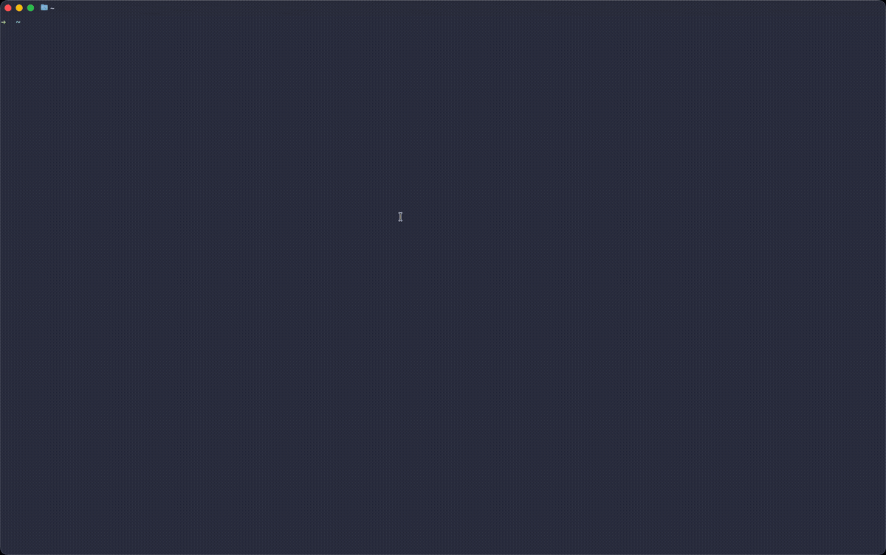

# gsx

**Ghostty Session Manager** — Launch AI-ready development environments with one command.

```bash
gsx myproject   # Opens Ghostty with Claude ready to go
```



## What it does

gsx creates pre-configured [Ghostty](https://ghostty.org) terminal windows for your projects:

- **3-column layout**: AI assistant | AI assistant | shell
- **2-column layout**: AI assistant | shell
- **Main + bottom**: AI assistant on top, shell below

No more manually opening terminals, splitting panes, cd-ing to directories, and launching Claude/Aider/Copilot.

## Installation

### From source

```bash
git clone https://github.com/minorole/gsx.git
cd gsx
./install.sh
```

### Requirements

- macOS (uses AppleScript for window management)
- [Ghostty](https://ghostty.org) terminal
- zsh
- **Accessibility permission** for your terminal (see below)

### Granting Accessibility Permission

gsx uses AppleScript to control Ghostty windows. macOS requires you to grant accessibility permission:

1. Open **System Settings** → **Privacy & Security** → **Accessibility**
2. Click the **+** button
3. Add your terminal app (Terminal.app, iTerm, or wherever you run `gsx`)
4. Ensure the checkbox is enabled

Without this permission, gsx will fail to create window splits.

## Usage

### First-time setup

```bash
gsx setup
```

This interactive wizard will ask for:
- Your projects folder (e.g., `~/Projects`)
- Default layout (3-col, 2-col, main+bottom)
- Commands for each pane

### Launch a session

```bash
gsx myproject           # Launch session for 'myproject'
gsx                     # Interactive project picker
```

### Per-project configuration

```bash
gsx setup myproject     # Configure overrides for 'myproject'
```

This lets you set different layouts or commands for specific projects.

### Other commands

```bash
gsx list                # List all projects
gsx config              # Show current configuration
gsx help                # Show help
gsx myproject --dry-run # Preview without opening windows
gsx ./help              # Open project with reserved name
```

**Reserved names:** `help`, `setup`, `config`, `list`, `uninstall`, `version`. Use `./` prefix if your project has one of these names.

## Configuration

Config is stored in `~/.config/gsx/config.yaml`:

```yaml
projects_root: ~/Projects
default_layout: 3-col

default_commands:
  left: "claude"
  middle: "claude"
  right: ""

# Per-project overrides
projects:
  my-web-app:
    layout: 2-col
    commands:
      left: "npm run dev"
      right: ""

  my-ai-project:
    commands:
      left: "aider"
      middle: "claude"
      right: ""
```

> **Tip:** Use `clear && claude` for a cleaner startup. For fully automated workflows, Claude supports `--dangerously-skip-permissions` (use with caution).

## Layouts

| Layout | Panes | Best for |
|--------|-------|----------|
| `3-col` | AI \| AI \| shell | Heavy AI-assisted coding |
| `2-col` | AI \| shell | Balanced workflow |
| `main+bottom` | AI (top) \| shell (bottom) | Focus on AI output |

## How it works

gsx uses AppleScript to:
1. Open a new Ghostty window
2. `cd` to your project directory
3. Create splits based on your layout
4. Run configured commands in each pane

All panes inherit the project directory, so you're ready to code immediately.

## Tips

**Avoid leftover terminal:** When you run `gsx` from a terminal, that terminal stays open. To avoid this:
- Run from Spotlight/Alfred/Raycast instead
- Or use `gsx myproject && exit` to auto-close

## Uninstalling

To completely remove gsx:

```bash
gsx uninstall
```

This will:
- Remove program files (`~/.local/share/gsx/`)
- Remove the symlink (`~/.local/bin/gsx`)
- Optionally remove your config (`~/.config/gsx/`)

If you cloned the repo, you can also delete that directory.

## Roadmap

- [ ] Session save/restore
- [ ] More layout options (grid, custom)
- [ ] Linux support (xdotool)
- [ ] Homebrew tap

## License

MIT — see [LICENSE](LICENSE)

## Credits

Built for the [Ghostty](https://ghostty.org) terminal by Mitchell Hashimoto.

Inspired by the friction of setting up AI coding environments every. single. time.
