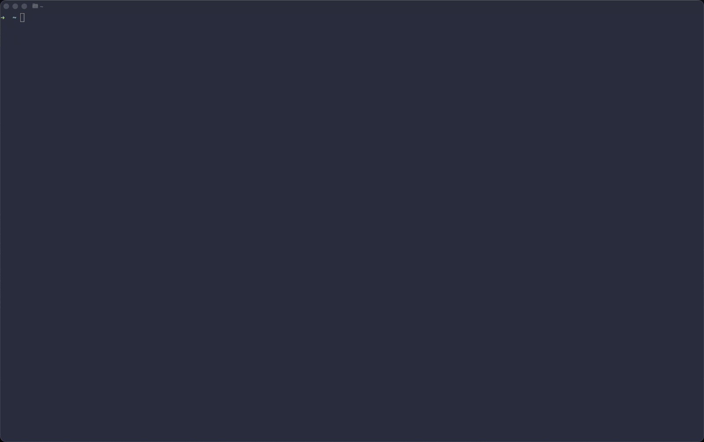

<p align="center">
  
</p>

<h1 align="center">gpane</h1>

<p align="center">
  <strong>Ghostty Session Manager</strong><br>
  Launch AI-ready terminal environments with one command
</p>

<p align="center">
  <a href="#installation">Install</a> •
  <a href="#usage">Usage</a> •
  <a href="#layouts">Layouts</a> •
  <a href="#configuration">Config</a>
</p>

<br>

<p align="center">
  
</p>

<br>

## What it does

gpane creates pre-configured [Ghostty](https://ghostty.org) terminal windows for your projects — multiple panes, each running the command you want, all from a single invocation.

```bash
gpane myproject     # Opens configured layout with Claude, Aider, shell, etc.
gpane               # Interactive picker — type "1 3 5" to open multiple projects
```

No more manually opening terminals, splitting panes, navigating to directories, and launching tools.

## Installation

**Homebrew** (recommended):
```bash
brew install minorole/tap/gpane
```

**One-liner**:
```bash
curl -sSL https://raw.githubusercontent.com/minorole/gsx/main/install.sh | bash
```

<details>
<summary><strong>From source</strong></summary>

```bash
git clone https://github.com/minorole/gsx.git
cd gsx && ./install.sh
```
</details>

<details>
<summary><strong>Requirements</strong></summary>

- macOS (uses AppleScript for window management)
- [Ghostty](https://ghostty.org) terminal
- zsh
- Accessibility permission for your terminal (System Settings → Privacy & Security → Accessibility)
</details>

<details>
<summary><strong>Upgrading from gsx?</strong></summary>

In v0.2.4, `gsx` was renamed to `gpane` to avoid conflict with Ghostscript.

Just run the installer — it automatically migrates your installation:
```bash
curl -sSL https://raw.githubusercontent.com/minorole/gsx/main/install.sh | bash
```

Your config is preserved. The old `gsx` command still works (shows a daily reminder to use `gpane`).
</details>

## Usage

**First-time setup:**
```bash
gpane setup
```

The wizard asks for your projects folder, default layout, and commands for each pane.

**Launch a session:**
```bash
gpane                     # Interactive picker
gpane myproject           # Open in new window
gpane myproject --here    # Open in current Ghostty window
gpane myproject --new-window # Override current_window config
gpane myproject --dry-run # Preview without opening windows

# Nested projects — works from any directory
cd ~/monorepo && gpane frontend
```

**Per-project config:**
```bash
gpane setup myproject     # Override layout/commands for this project
```

**Other commands:**
```bash
gpane list      # List all projects
gpane config    # Show current configuration
gpane help      # Show help
gpane version   # Show version
```

## Layouts

### Presets

| Preset | Panes | Description |
|--------|-------|-------------|
| `duo` | 2 | Side-by-side |
| `trio` | 3 | Three columns |
| `stacked` | 2 | Top and bottom |
| `quad` | 4 | 2×2 grid |
| `dashboard` | 4 | 1 main top, 3 below |
| `wide` | 4 | 3 top, 1 bottom |
| `main-side` | 3 | 1 main left, 2 stacked on the right |
| `side-main` | 3 | 2 stacked on the left, 1 main right |

### Custom layouts

Row notation — numbers separated by dashes, each number = panes in that row. Commands run left-to-right in each row, then top-to-bottom:

```
2-2     → 4 panes (2 top, 2 bottom)
1-3     → 4 panes (1 top, 3 bottom)
1-2-1   → 4 panes (1 top, 2 middle, 1 bottom)
3-3-3   → 9 panes (3×3 grid)
2-2-5-1 → 10 panes
```

Column notation — numbers separated by pipes, each number = panes in that column. Commands run top-to-bottom in each column, then left-to-right:

```
1|2     → 3 panes (1 left, 2 right)
2|1     → 3 panes (2 left, 1 right)
2|3|1   → 6 panes (2 left, 3 middle, 1 right)
```

Max 10 panes, max 4 rows or columns.

## Configuration

Config lives at `~/.config/gpane/config.yaml` (new installs) or `~/.config/gsx/config.yaml` (existing users):

```yaml
projects_root: ~/Projects
default_layout: quad
current_window: true

# Commands for each pane:
# - row layouts: left-to-right, then top-to-bottom
# - column layouts: top-to-bottom, then left-to-right
default_commands:
  - "claude"
  - "aider"
  - "npm run dev"
  - ""

# Per-project overrides
projects:
  my-web-app:
    layout: dashboard
    commands:
      - "claude"
      - "npm run dev"
      - "npm test"
      - "tail -f logs"

  simple-project:
    layout: duo
    commands:
      - "claude"
      - ""
```

`projects_root` is the default folder gpane searches for `gpane list`, the interactive picker, and project names like `gpane myproject`. It does not block absolute paths, relative paths such as `./frontend`, or the current-directory fallback for nested projects.

Set `current_window: true` to make launches reuse the current Ghostty window by default, the same behavior as `gpane myproject --here`.

## Uninstalling

```bash
gpane uninstall
```

Removes program files and symlink. Optionally removes your config.

## License

MIT — see [LICENSE](LICENSE)

---

<p align="center">
  Built for <a href="https://ghostty.org">Ghostty</a> by Mitchell Hashimoto.<br>
  <sub>Inspired by the friction of setting up AI coding environments every. single. time.</sub>
</p>
